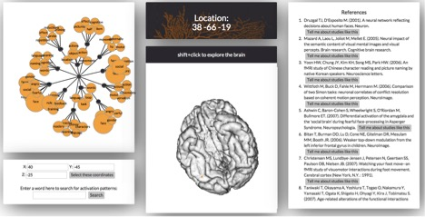
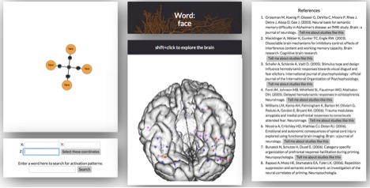
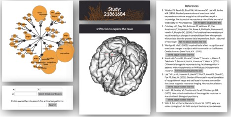

Brain Odyssey is a data visualization webapp that unlocks the secrets of the brain for the broader public, while abstracting away the technical jargon internal to the research community. By interacting with a 3D brain, users can visualize what parts of the brain are associated with what functions, and can seek information about related references, in an intuitive and accessible way. 

Technical stack: SQLite, SQLAlchemy, Python, Flask, Javascript, JQuery, AJAX, HTML, CSS
APIs: BrainBrowser, D3, scikit learn 

Brain Odyssey combines `BrainBrowser <https://brainbrowser.cbrain.mcgill.ca/>`, a JavaScript library for 3D rendering of neuroanatomical data, with `D3 <http://d3js.org/>` force directed graphs, in order to visualize hierarchically clustered brain functions. Data visualizations are generated by querying the `Neurosynth <http://http://neurosynth.org/>` dataset, which contains information about 11406 neuroimaging studies, reporting nearly 400,000 brain activations. This dataset additionally provides information about the words associated with each study, and frequency metrics associated with those words (tf-idf metrics). Words are clustered into topics using Latent Dirichlet Allocation, and additional batch processing on the dataset was performed to cluster related studies together. 

The data are seeded into seven tables: 

#   Location:       individual x-y-z locations
#   Study:          individual studies
#   Activation:     location-study associations
#   Term:           individual words
#   StudyTerm:      associations between studies and words
#   TermCluster:    associations between words and topic clusters
#   Cluster:        topic cluster IDs

Users can interact with BrainBrowser in three ways, each triggering AJAX calls to the database for information display in the D3, references or Brainbrowser: 

(1) Exploring a region of the brain: 

Pressing shift+click on any part of the 3D brain, or manually entering x-y-z coordinates for a region of interest, will trigger a query for topically clustered brain functions associated with that region, along with a list of references citing activation in that location.

(2) Exploring a word or word cluster: 

Clicking on a word or word cluster, or manually entering a word into the search bar, will generate a new color map on the brain displaying the regions associated with the selected word(s), colored by intensity. References associated with the selected word(s) will also be generated. In the D3 window, users will see the topics associated with the selected word, or the words associated with the selected topic. 

(3) Exploring references:

Users can ask for more information about a particular reference by clicking on the button next to it. This will display information about locations activated in related studies, words/topics associated with that set of studies, and the associated references. 

